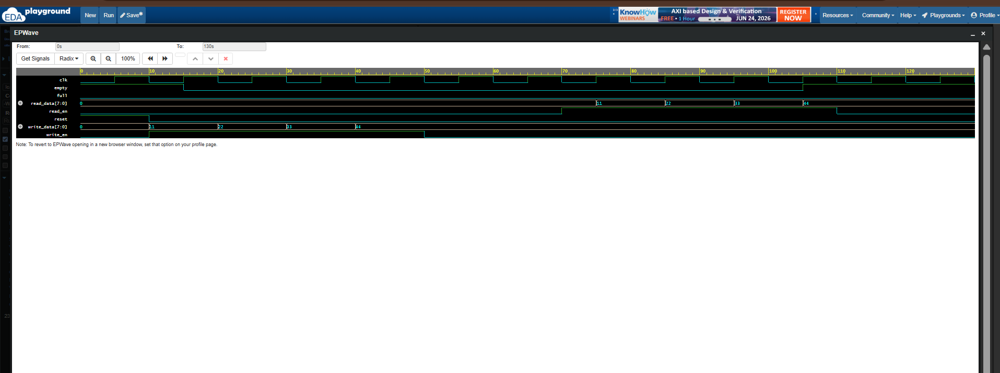

# 📦 FIFO Buffer Using Verilog HDL

An 8×8 FIFO (First-In First-Out) Buffer designed and verified using Verilog HDL. This project demonstrates memory-based buffering, pointer management, and full/empty status generation, which are fundamental concepts used extensively in digital systems and ASIC/FPGA designs.

---

## 🌟 Project Overview

FIFO (First-In First-Out) is a temporary storage structure where the first data written into the buffer is the first data to be read out.

This project implements an **8-bit wide, 8-location FIFO Buffer** using Verilog HDL and verifies its functionality using a dedicated testbench and waveform analysis.

---

## ✨ Features

✅ 8-bit Data Width

✅ 8-Location Memory Depth

✅ FIFO Read and Write Operations

✅ Full Flag Generation

✅ Empty Flag Generation

✅ Reset Functionality

✅ Pointer Management

✅ Verilog Testbench Verification

✅ EPWave Simulation Analysis

---

## 🛠️ Tools Used

- 💻 Verilog HDL
- 🌐 EDA Playground
- 📈 EPWave
- 🐙 GitHub

---

## 📂 Repository Structure

```
Verilog-FIFO-Buffer/
│
├── fifo.v
├── fifo_tb.v
├── fifo_waveform.png
└── README.md
```

---

## 🧠 FIFO Architecture

```
             +------------------+
write_en --->|                  |
write_data -->|      FIFO       |--> read_data
 read_en --->|                  |
             +------------------+
                     ↑
               Full / Empty
```

---

## 📥 Inputs

| Signal | Description |
|----------|-------------|
| clk | System Clock |
| reset | Resets the FIFO |
| write_en | Enables write operation |
| read_en | Enables read operation |
| write_data[7:0] | Data to be written |

---

## 📤 Outputs

| Signal | Description |
|----------|-------------|
| read_data[7:0] | Data read from FIFO |
| full | Indicates FIFO is full |
| empty | Indicates FIFO is empty |

---

## 🔄 FIFO Operation Example

### Writing Data

```
11
22
33
44
```

FIFO Contents:

```
Front → 11 → 22 → 33 → 44 ← Rear
```

---

### Reading Data

Data exits in the same order:

```
11
22
33
44
```

This demonstrates the **First-In First-Out** principle.

---

## 📊 Simulation Waveform

The waveform below verifies:

- FIFO Write Operation
- FIFO Read Operation
- Empty Flag Behaviour
- Reset Functionality
- Correct Data Order



---

## ✅ Simulation Results

| Feature | Status |
|-----------|---------|
| Reset Operation | ✅ Passed |
| Write Operation | ✅ Passed |
| Read Operation | ✅ Passed |
| FIFO Ordering | ✅ Passed |
| Empty Flag | ✅ Passed |
| Full Flag | ✅ Passed |

---

## 🎯 Applications

- UART Buffers
- Communication Interfaces
- Processor Data Queues
- DMA Controllers
- Memory Controllers
- ASIC Designs
- FPGA-Based Systems

---

## 👩‍💻 Author

**Aneesa Pattan**

Final Year Electronics and Communication Engineering (ECE) Student

Passionate about RTL Design, Verilog HDL, Digital Design, and VLSI.

---
